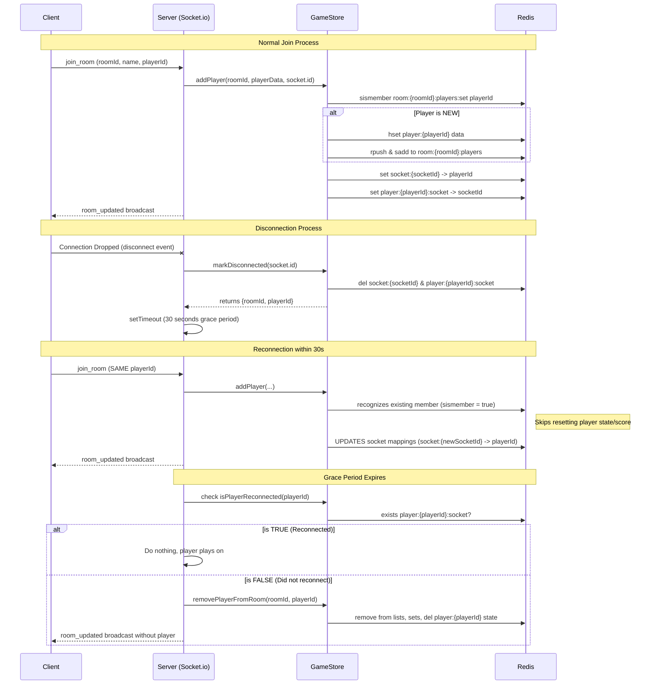
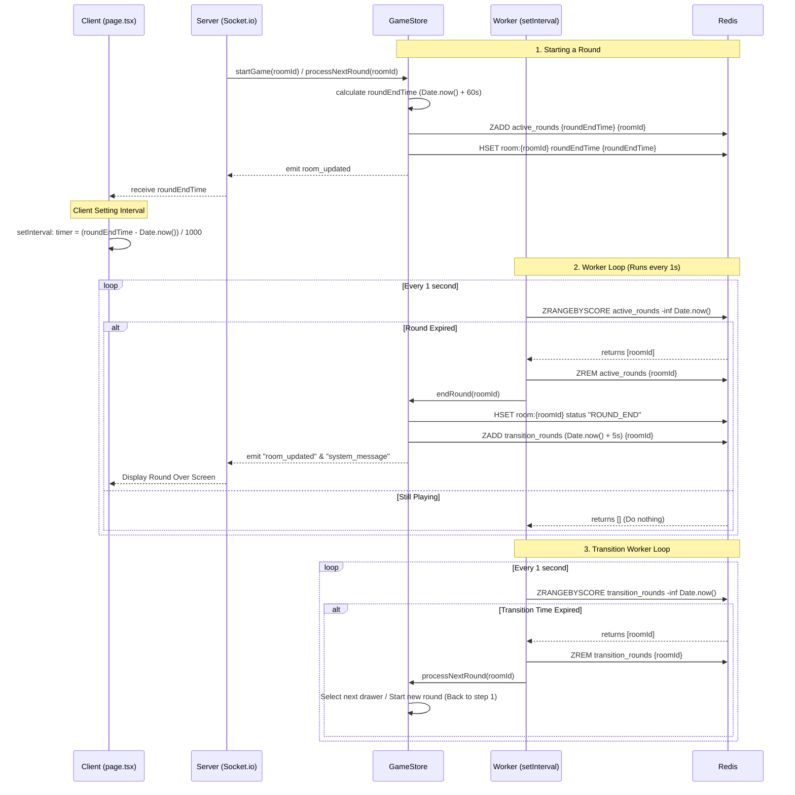

# Latest Game State Refactoring & Reconnection Logic

## 1. Overview of Changes

The latest updates to the codebase focus on robustness, scalability, and better user experience related to network drops. We specifically improved how physical sockets map to logical players using a Redis-backed architecture.

1. **Redis Architecture Refactoring**:
   - Fixed `WRONGTYPE` errors by strictly enforcing Redis datatypes. For objects (like `Player` and `Room`), the system now strictly uses Hashes (`HSET`/`HGETALL`) instead of mixing strings and JSON.
   - Separate Redis Sets (`sadd`) and Lists (`rpush`) are used to manage collections of players, ensuring order and easy "member exists" checks.

2. **O(1) Data Access for Sockets (Disconnection Optimization)**:
   - Previously, the app iterated through keys using `redis.keys` to find which player owned a disconnecting socket id.
   - Now, a direct two-way mapping is maintained: 
     - `socket:{socketId}` $\rightarrow$ `playerId`
     - `player:{playerId}:socket` $\rightarrow$ `socketId`
   - This changes the disconnection lookup from $O(N)$ (scanning all keys) to $O(1)$.

3. **Resilient Player Reconnection Loop**:
   - Dropping a socket connection no longer immediately purges a player's score and presence from the room.
   - When a user disconnects, their sockets are unregistered, but their `Player` state remains.
   - A 30-second `setTimeout` grace period begins. If the user rejoins the frontend with the same persistent `playerId`, the server re-binds their physical socket connection to their existing state.
   - If the player fails to rejoin within 30 seconds, a cleanup task formally removes them from the game.

## 2. Architecture & Flow Diagram

The sequence diagram below visualizes the seamless player reconnection and cleanup logic.

## 3. Redis-Backed Round Timer Logic

Recent changes across `gameState.ts`, `roomHandler.ts`, and `page.tsx` overhauled how round durations and transitions are managed, making the system scalable and independent of server memory constraints.

1. **Background Worker Loop (`gameState.ts` & `roomHandler.ts`)**:
   - Instead of using native `setTimeout` which wouldn't scale gracefully horizontally and might cause memory leaks on failure, a `workerLoop` is started when `gameStore.setIo(io)` is called inside the `roomHandler`.
   - This worker loop checks Redis using `zrangebyscore` to fetch rounds that have timed out based on `Date.now()`.

2. **Redis Sorted Sets (ZADD / ZRANGEBYSCORE)**:
   - When a round starts, the ending timestamp `roundEndTime` is calculated and inserted into a Redis Sorted Set (`active_rounds`) using its timestamp as the score.
   - When the worker detects that the `roundEndTime` is in the past, it calls `endRound` seamlessly.
   - The same system is used for transition screens via the `transition_rounds` set, waiting 5 seconds before pulling the next drawer.

3. **Client-Side Timer Interpolation (`page.tsx`)**:
   - The server passes `roundEndTime` directly to the Next.js client.
   - The frontend sets an interval to continually subtract `Date.now()` from `roundEndTime`, resulting in a perfectly synced, drifting-resistant countdown timer across all clients.

4. **Dynamic Scoring**:
   - Player scores are calculated proportionally based on the time remaining when they make a correct guess (`timeRatio`).

### Timer & Round Transition Flow

The following diagram illustrates how the background worker transitions rounds without relying on native Node.js timers:

